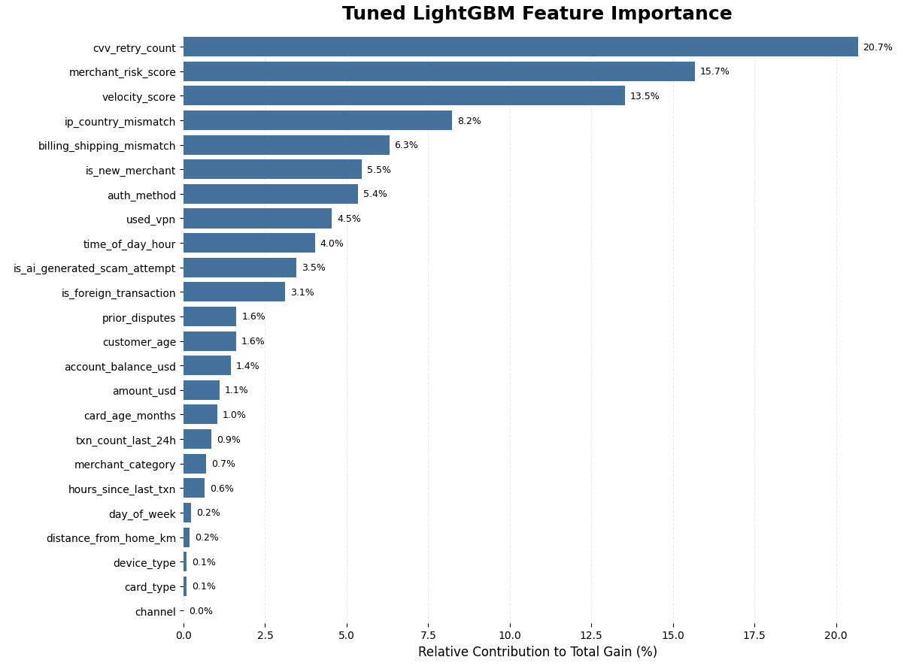
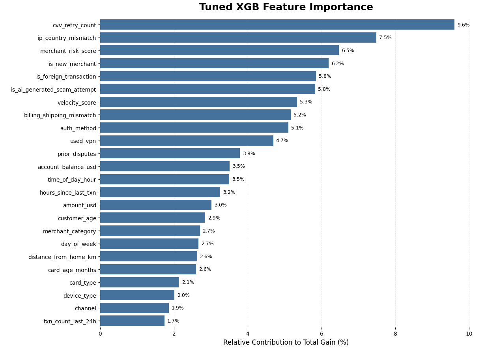
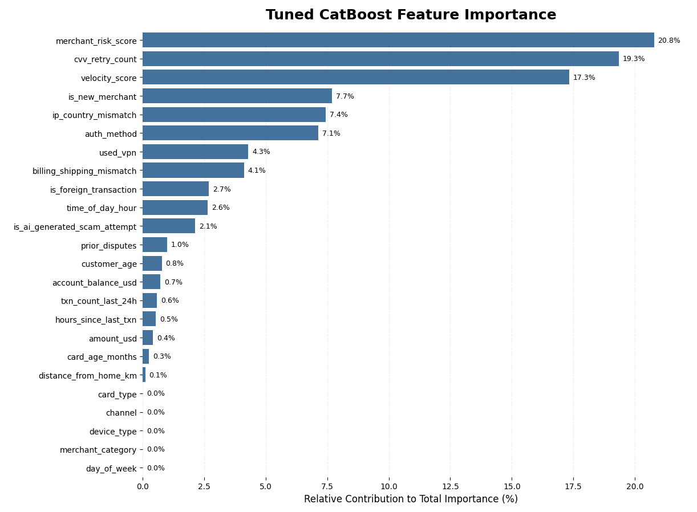
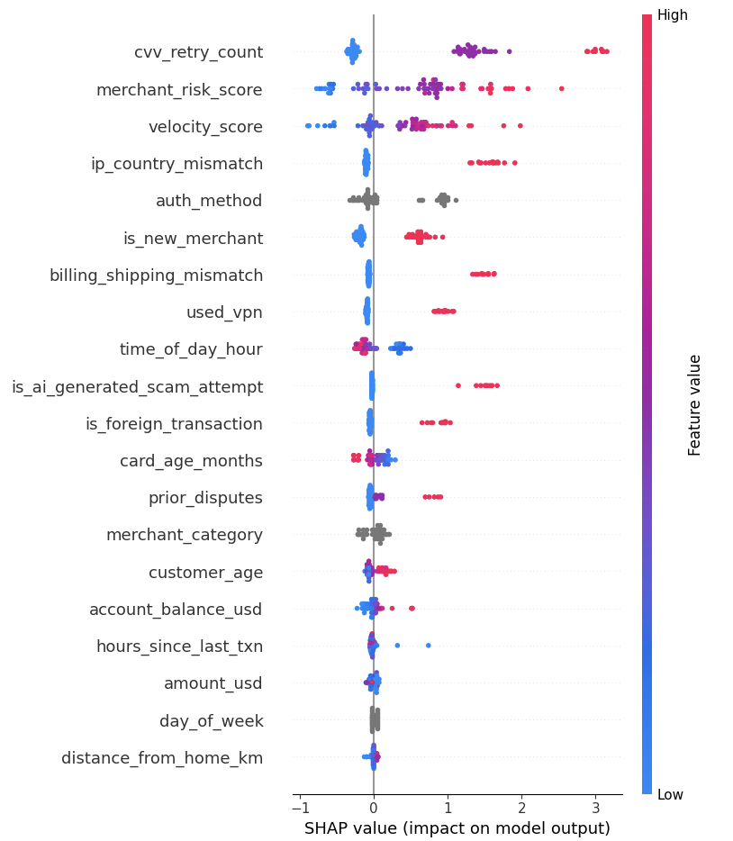
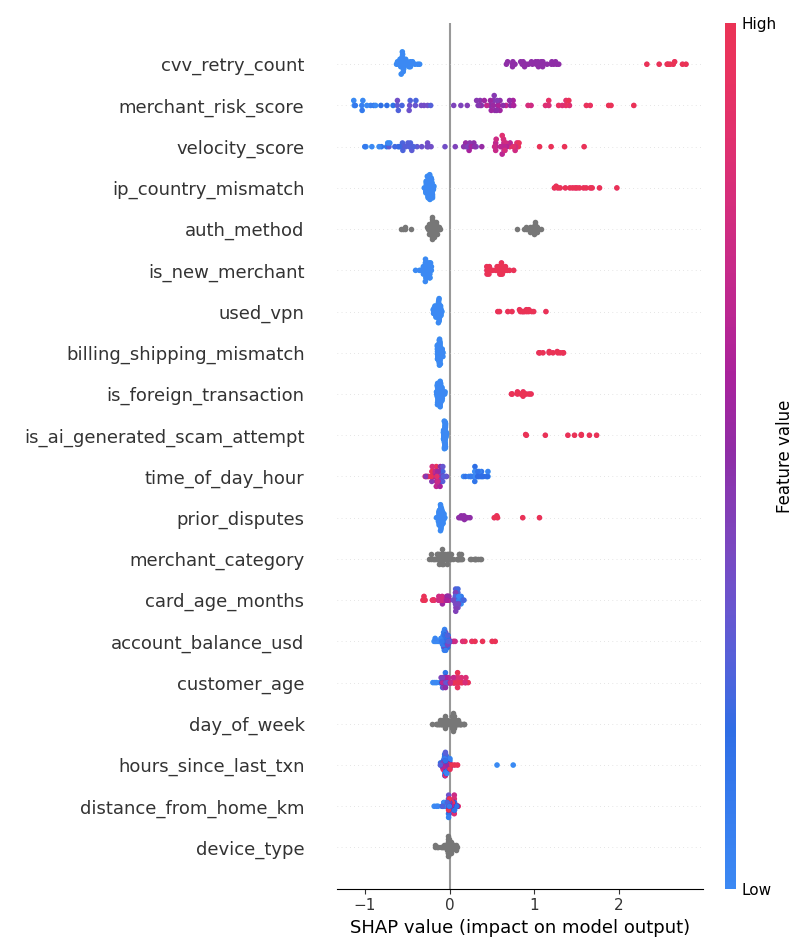
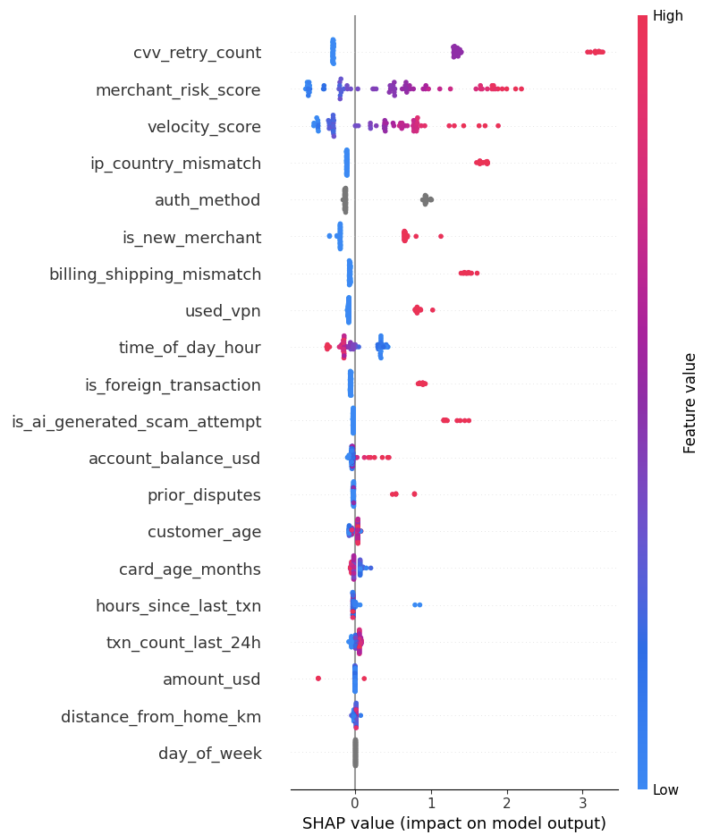
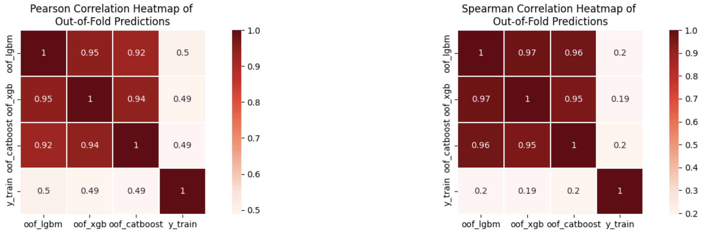
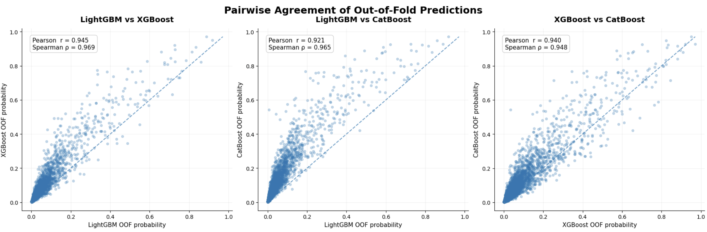
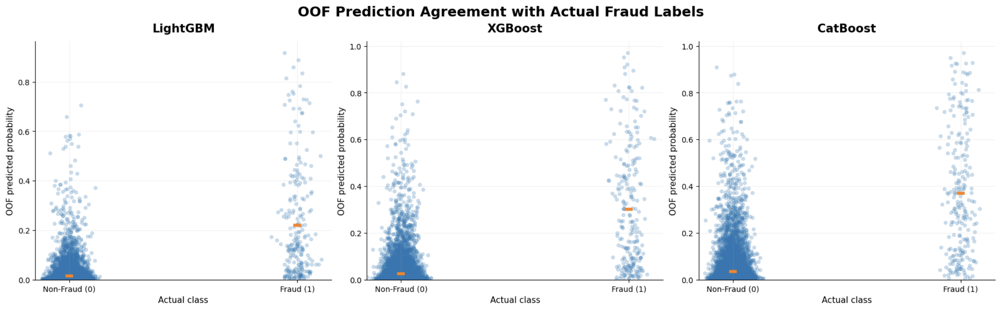

# Fraud Detection on an Interpretable Transaction Dataset

This project applies gradient-boosted tree models (LightGBM, XGBoost, and CatBoost) to a 2026-style credit card fraud dataset in which every feature is named and interpretable, rather than anonymized into unlabeled PCA components (`V1...V28`) as in the conventional benchmark. Signals such as `cvv_retry_count`, `velocity_score`, `ip_country_mismatch`, and `is_ai_generated_scam_attempt` can be directly explained to a risk or compliance audience, making the resulting feature-importance and SHAP analyses substantively meaningful rather than purely statistical. The work covers model tuning, interpretability analysis, and a comparison of ensembling versus stacking strategies for combining the three models.

---

## 🗂️ The Dataset

| | |
|---|---|
| **Rows** | 20,000 transactions |
| **Fraud rate** | 1.70% (339 fraud cases) — severely imbalanced |
| **Columns** | 26, all named and interpretable |
| **Missing values** | 0 |
| **What makes it 2026-flavored** | `is_ai_generated_scam_attempt`, modern auth methods (3D Secure, OTP, biometric), contactless/in-app channels, VPN usage, crypto-exchange merchants |

Because nothing is anonymized, feature importance and SHAP plots tell an actual *story* instead of "V14 matters, nobody knows why."

With only 1.7% positive cases, plain accuracy is a trap (98.3% for guessing "not fraud" every time). Everything here is evaluated on **Average Precision (PR-AUC)** instead.

---

## 🧪 The Approach

1. Train **LightGBM**, **XGBoost**, and **CatBoost**, each hyperparameter-tuned across 5 stratified folds with out-of-fold (OOF) predictions.
2. Interpret each model with **feature importance** and **SHAP** analysis.
3. Combine models two ways: a **weighted average ensemble** and a **stacked logistic-regression meta-model**.
4. Stress-test both blends across **15 random seeds** to see which one is genuinely better, not just lucky.

---

## 📊 Individual Model Performance (Average Precision)

| Model | Mean CV AP (folds) | Overall OOF AP | Test AP |
|---|---|---|---|
| **LightGBM** | 0.439 | 0.423 | 0.334 |
| **CatBoost** | 0.438 | 0.424 | 0.345 |
| **XGBoost** | 0.428 | 0.413 | 0.315 |

All three models land in a tight, consistent band where no single learner dominates, which is exactly the setup where ensembling tends to pay off.

---

## 🧩 Ensembling vs. Stacking

| Method | Test AP |
|---|---|
| Weighted Ensemble (LGBM 0.521 / XGB 0.296 / Cat 0.183) | 0.344 |
| **Stacked (Logistic Regression meta-model)** | **0.349** |

**Stability across 15 seeds:**

| Method | Mean AP | Std | CV | Min | Max |
|---|---|---|---|---|---|
| Ensemble | 0.3462 | 0.0070 | 2.04% | 0.3376 | 0.3619 |
| **Stacking** | **0.3528** | 0.0064 | 1.83% | 0.3390 | 0.3669 |

**Head-to-head:** stacking beat the weighted ensemble in **13 of 15 seeds**, with a mean lift of **+0.0066 AP** (median +0.0050). 

---

## 🔍 What Actually Drives the Predictions

Across LightGBM, XGBoost, and CatBoost, the same handful of features keep showing up at the top, indicating that the models are converging on genuine fraud signal rather than noise:

- **`cvv_retry_count`** and **`velocity_score`**: behavioral red flags, consistently the top 2-3 features everywhere
- **`merchant_risk_score`**: a strong, monotonic driver of fraud probability
- **`ip_country_mismatch`**, **`billing_shipping_mismatch`**, **`used_vpn`**: classic identity/location inconsistency signals
- **`is_new_merchant`** and **`is_foreign_transaction`**: context features that sharply raise risk
- **`is_ai_generated_scam_attempt`**: the 2026-native feature, and it earns its place with a clear, high SHAP impact

<table>
<tr>
<td></td>
<td></td>
</tr>
<tr>
<td align="center"><em>LightGBM Feature Importance</em></td>
<td align="center"><em>XGBoost Feature Importance</em></td>
</tr>
</table>

<em>CatBoost Feature Importance</em>

**Concentration differs sharply across models.** LightGBM and CatBoost each let a single feature dominate:  `cvv_retry_count` alone accounts for 20.7% of LightGBM's total gain, and `merchant_risk_score` for 20.8% of CatBoost's, with the top three features together explaining roughly half of all importance in both models. XGBoost tells a different story: its top feature (`cvv_retry_count`) captures only 9.6%, and importance is spread thinly across nearly 20 features before tapering off. This reflects XGBoost's shallower, more conservative splits distributing decision-making across more of the feature set. That structural difference is also *why* XGBoost pairs well in an ensemble: it's not just a weaker copy of the other two but is making decisions along a genuinely different axis.

**A second, consistent pattern:** engagement/device metadata (`card_type`, `channel`, `device_type`, `day_of_week`) and (for two of the three models) `merchant_category` sits at or near 0% importance across all three models. Once behavioral and identity-mismatch signals are in the model, *how* someone paid or *what device* they used adds essentially nothing. That's a useful, actionable finding on its own: these columns are strong candidates for pruning in a production feature set without any expected loss in detection power.

**SHAP summary plots** confirm the direction of each effect (e.g., high `cvv_retry_count` and high `velocity_score` push predictions strongly toward fraud):

<table>
<tr>
<td></td>
<td></td>
<td></td>
</tr>
<tr>
<td align="center"><em>LightGBM SHAP Plot</em></td>
<td align="center"><em>XGBoost SHAP Plot</em></td>
<td align="center"><em>CatBoost SHAP Plot</em></td>
</tr>
</table>

**Two distinct "shapes" of risk signal emerge from the dependence panels**:

- *Trip-wire features* behave almost like on/off switches: `used_vpn`, `ip_country_mismatch`, `billing_shipping_mismatch`, and `is_new_merchant` sit near a SHAP value of 0 when false, then jump sharply positive the instant they flip to true, with very little in between. A mismatch either exists or it doesn't, and when it does, the model treats it as a strong, almost independent vote for fraud.
- *Dose-response features* scale continuously with risk: `velocity_score` and `merchant_risk_score` show a smooth, near-linear climb in SHAP value as the underlying score rises, meaning the model isn't just thresholding these, it's using the full range of values to size its confidence.
- `cvv_retry_count` is a hybrid of both — a discrete feature (0, 1, 2 retries) that nonetheless produces a clean *staircase*, with each additional retry adding a large, consistent chunk of fraud probability, making it behave like a graded trip-wire rather than a purely continuous score.
- `auth_method` is quietly one of the more interesting features: transactions cleared with "No Authentication" carry a large positive SHAP value relative to every other method (3D Secure, Biometric, OTP, PIN), which cluster together near zero or slightly negative — the models have effectively learned that the *absence* of a real authentication step is itself the risk signal, not which specific method was used.
- `card_age_months` and `time_of_day_hour` contribute smaller but directionally sensible effects: newer cards and very early/late transaction hours nudge risk upward, while older cards and mid-day hours pull it down, serving as plausible proxies for account-tenure risk and off-hours fraud activity respectively.
- The color-coded interactions are also informative: high `velocity_score` combined with high `cvv_retry_count` or `txn_count_last_24h` produces visibly larger SHAP jumps than either feature moving alone, suggesting the models have partially learned a compounding-risk pattern rather than treating each signal independently.

---

## 🤝 Do the Models Agree With Each Other?

The three models' OOF predictions correlate **0.92–0.95 (Pearson)** and **0.95–0.97 (Spearman)** with each other, indicating they are largely learning the same underlying pattern. But correlation with the actual fraud label sits much lower (Pearson ~0.49–0.50, Spearman ~0.19–0.20). The gap between those two numbers is itself worth noting: Pearson correlation is pulled up by a relatively small number of very-high-confidence true positives that exert outsized leverage on a linear measure, while Spearman, which cares about relative ranking across all 20,000 transactions, is more modest. Most of the "correct" ranking work is happening only at the extreme top of the score distribution, which is exactly what you'd expect at a 1.7% base rate: the model doesn't need to rank the bulk of clearly-legitimate transactions well but only the sliver near the decision boundary.

The pairwise scatter plots add a layer the correlation table alone can't show: **systematic bias between models, not just noise.** Points cluster along the diagonal in bulk, but with visible asymmetric fanning — in the LightGBM-vs-XGBoost and LightGBM-vs-CatBoost panels, a large share of points sit *above* the diagonal, meaning XGBoost and CatBoost tend to assign meaningfully higher probabilities than LightGBM does to the same transactions, especially in the mid-to-high probability range. LightGBM behaves more conservatively across the board. This kind of consistent directional disagreement, rather than random scatter, is precisely the kind of structure a stacking meta-model can learn to correct for, which helps explain why stacking outperforms a static weighted average.

The strip plots make the separation (and its limits) concrete. Median predicted probability for actual non-fraud transactions sits close to zero for all three models (roughly 0.02–0.04), while the median for actual fraud cases is far higher, being around 0.22 for LightGBM, 0.30 for XGBoost, and 0.36 for CatBoost, being a 7-to-18x gap between classes depending on the model. CatBoost's noticeably higher fraud-class median lines up with it also posting the strongest individual test AP (0.345), suggesting it's not just ranking fraud cases correctly more often but also doing so with greater confidence.

That said, the overlap is still substantial and worth being honest about: a meaningful cluster of true fraud cases sits scored below 0.2 across all three models: the "hard" fraud cases that look statistically similar to legitimate transactions on these features, while a long tail of legitimate transactions still scores above 0.4–0.6. This 0.1–0.4 probability band is where the real operational tension lives, and it's exactly the region a business would need to study closely when setting a deployment threshold, since it contains the bulk of both the false negatives being missed and the false positives that would need manual review.

---

## 💡 Key Takeaways

- **Behavioral + identity-mismatch features dominate**: `cvv_retry_count`, `velocity_score`, and `merchant_risk_score` alone carry roughly half of total feature importance across models.
- **No single boosted-tree model wins outright**: LightGBM, XGBoost, and CatBoost land within ~0.03 AP of each other, which is exactly why blending them helps.
- **Stacking > simple weighted averaging**, consistently, though the gain is modest (~2% relative improvement). The meta-learner is extracting a bit of extra signal from *how* the base models disagree.
- **The 2026-native fraud signal works**: `is_ai_generated_scam_attempt` isn't just a novelty column but shows real, consistent SHAP impact.
- **XGBoost spreads its bets, LightGBM and CatBoost concentrate theirs**: XGBoost's flatter importance profile (top feature at just 9.6% vs. ~21% for the others) is a structural difference and it's a likely contributor to why the ensemble/stack benefits from including it despite its lower standalone AP.
- **Risk features split into two behavioral types**: binary features (`used_vpn`, `ip_country_mismatch`, `billing_shipping_mismatch`, `is_new_merchant`) that jump sharply the moment they're triggered, versus continuous signals (`velocity_score`, `merchant_risk_score`) that scale smoothly with risk, being a distinction worth preserving in any future feature engineering.
- **Transaction metadata is largely dead weight**: `card_type`, `channel`, `device_type`, and `day_of_week` sit near-zero across all three models, making them strong candidates to drop for a leaner production feature set.
- **Model agreement is high in relative ranking, low in absolute correlation with the label**: the Pearson/Spearman gap against `y_train` (~0.49 vs ~0.20) is a reminder that this is fundamentally a rare-event ranking problem: the models agree strongly with each other, but only a small top slice of predictions carries the real class-separating signal.
- **There's real, visible headroom in the 0.1–0.4 probability band**: the OOF distribution overlap shows neither the false negatives nor the false positives are noise; they cluster in an identifiable range, which is where threshold tuning and calibration work (see Future Work) would have the most practical impact.

---

## 🚀 Future Work

- **Resampling & cost-sensitive learning**: try SMOTE/ADASYN variants or class-weighted focal loss to see if recall on the rare fraud class can be pushed further without hurting precision.
- **Threshold tuning for deployment**: pick an operating point on the precision-recall curve tied to a real business cost (false positive vs. missed fraud), rather than optimizing AP alone.
- **Richer meta-learners**: swap the logistic regression stacker for a shallow gradient-boosted or small neural meta-model, and add OOF-prediction *interactions* (e.g., model disagreement/variance) as meta-features.
- **Feature engineering**: interaction terms (`cvv_retry_count × velocity_score`), rolling/behavioral aggregates per customer or merchant, and anomaly-detection scores (Isolation Forest, autoencoder reconstruction error) as extra model inputs.
- **Probability calibration**: apply Platt scaling or isotonic regression so predicted probabilities are trustworthy for downstream risk scoring, not just good for ranking.
- **Repeated/nested cross-validation**: tighten the seed-to-seed variance already observed (CV ≈ 2%) with repeated stratified folds for more robust model selection.

---

## 🌟 Closing Note

What started as three independently tuned boosted-tree models ended up as a genuinely interpretable and well-agreeing fraud detection pipeline. one where a risk analyst could look at the top SHAP drivers and immediately recognize real fraud behavior and not abstract components. Stacking nudged performance past simple ensembling in a consistent, low-variance way, and the roadmap above has plenty of runway left. For a rare-event problem starting at a 1.7% base rate, getting predicted-fraud probabilities to separate this cleanly and to explain *why* is a solid foundation to build on. 
